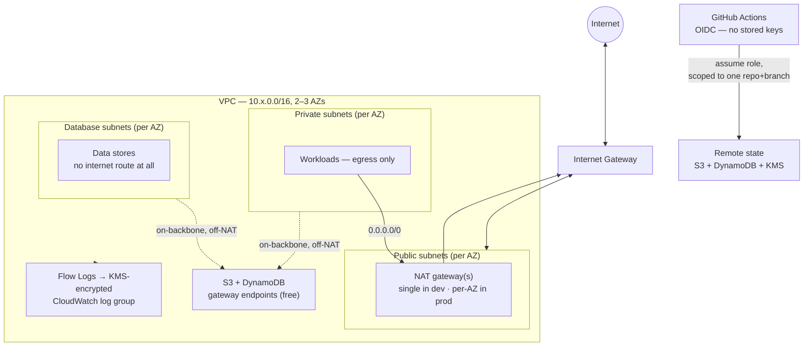

# Terraform AWS Baseline

A secure-by-default AWS account baseline in Terraform — encrypted remote state,
a multi-AZ VPC with an isolated database tier, and IAM that eliminates every
long-lived credential — so a new account starts from a defensible posture
instead of a blank console.

[](https://github.com/JohnNessime/terraform-aws-baseline/actions/workflows/ci.yml)
[](https://github.com/JohnNessime/terraform-aws-baseline/actions/workflows/checkov.yml)
[](https://developer.hashicorp.com/terraform)
[](LICENSE)


## Architecture



More detail, including the module composition diagram:
[`docs/architecture.md`](docs/architecture.md).

## Security decisions

**OIDC instead of static keys.**
CI assumes a role with a short-lived GitHub-signed token. There is no AWS access
key stored in the repo to leak, and nothing to rotate.

**Trust policy scoped to one repo and one branch.**
The `sub` claim is matched with `StringEquals` on
`repo:<org>/<repo>:ref:refs/heads/<branch>`. A wildcard would let *any* matching
repo — with `repo:*`, any repo on GitHub — assume the role.

**State encrypted, versioned, and TLS-only.**
The state bucket uses SSE-KMS with a customer-managed rotating key, versioning
for recovery, all four public-access-block flags, and a policy that denies any
request where `aws:SecureTransport = false`. State can contain secrets.

**Default security group locked shut.**
`aws_default_security_group` is managed with zero rules. AWS's default allows
intra-group ingress and all egress; anything that accidentally lands on it gets
nothing.

**Database subnets fully isolated.**
Their route tables carry no default route — no IGW, no NAT. Nothing in the data
tier can reach the internet or be reached from it.

**SSM Session Manager instead of SSH.**
The EC2 role carries only `AmazonSSMManagedInstanceCore`. No port 22, no key
pairs, no bastion host — and every session is IAM-authorised and logged.

**Actions pinned to commit SHAs.**
Tags are mutable; a compromised action repo can repoint `v4` at malicious code.
A SHA cannot be moved. Dependabot keeps the pins current.

## Quickstart

```bash
# 1. Create the state backend (runs once, with local state).
cd bootstrap
terraform init
terraform apply
terraform output          # bucket, lock table, KMS key, region

# 2. Migrate bootstrap's own state into the bucket it just created.
#    Why this is necessary: docs/bootstrap.md
terraform init -migrate-state

# 3. Run the static gates — no AWS credentials needed.
cd ..
make all                  # fmt + validate + tflint + checkov

# 4. Point dev at the backend and plan.
cd environments/dev
cp backend.hcl.example backend.hcl            # fill from step 1's outputs
cp terraform.tfvars.example terraform.tfvars  # fill in repo + ARNs
terraform init -backend-config=backend.hcl
terraform plan
terraform apply
```

`backend.hcl` and `terraform.tfvars` are gitignored — the state bucket name
embeds the account ID, and neither belongs in a public repo.

## What it costs

Almost all of it is NAT gateways. At `us-east-1` on-demand pricing:

| Item | dev | prod |
|------|-----|------|
| NAT gateways | 1 × ~\$32/mo | 3 × ~\$32/mo ≈ \$97/mo |
| NAT data processing | ~\$0.045/GB | ~\$0.045/GB |
| VPC, subnets, route tables, IGW | free | free |
| S3 + DynamoDB gateway endpoints | **free** | **free** |
| CloudWatch flow logs | ~\$0.50/GB ingested, 7-day retention | same rate, 365-day retention |
| S3 state + DynamoDB (PAY_PER_REQUEST) | cents | cents |
| KMS keys | \$1/mo each | \$1/mo each |

Ballpark: **~\$35/month for dev, ~\$105/month for prod**, dominated by NAT. The
gateway endpoints are the one free lunch — they keep S3 and DynamoDB traffic
(including remote state) off the NAT, where it would otherwise be billed per GB.

Set `enable_nat_gateway = false` if you only need the isolated tiers, and tear
everything down with:

```bash
terraform destroy   # in environments/<env>, then bootstrap
```

Bootstrap sets `force_destroy = false` on both buckets, so a `destroy` will
refuse to delete non-empty state buckets until you opt in. That is deliberate.

## What I'd add next

Honest scope boundaries — things a complete platform needs that this doesn't
have:

- **No compute.** There's an EC2 instance role and profile, but nothing uses
  them. No ASG, no ECS/EKS, no load balancer.
- **No interface VPC endpoints.** Only the free S3/DynamoDB gateway endpoints.
  Fully private SSM (no NAT at all) needs interface endpoints for `ssm`,
  `ssmmessages`, and `ec2messages`, which cost ~\$7/mo each per AZ.
- **No `terraform plan` in CI.** That needs cloud credentials; the pipeline is
  deliberately static-only. A real setup would add a plan job on the OIDC role
  with a PR comment.
- **Single region, no DR.** Versioning and lifecycle cover state recovery, but
  there is no cross-region replication and no failover story.
- **No AWS Config, GuardDuty, Security Hub, or CloudTrail.** A genuine account
  baseline includes detective controls; this covers preventative ones.
- **No policy-as-code tests.** Checkov catches known misconfigurations, but
  there are no Terratest or OPA/Conftest assertions on the module contracts.
- **OIDC provider ownership is awkward.** It's account-global, so dev creates it
  and prod references it. In a real org it belongs in a separate account-level
  stack.

## Repository layout

| Path | What's in it |
|------|--------------|
| [`bootstrap/`](bootstrap/) | State backend — S3, DynamoDB, KMS. Runs once. |
| [`modules/tags/`](modules/tags/) | Mandatory tag schema and `name_prefix`. |
| [`modules/vpc/`](modules/vpc/) | Multi-AZ VPC, flow logs, endpoints, isolated DB tier. |
| [`modules/iam/`](modules/iam/) | OIDC CI role, MFA auditor role, SSM instance role. |
| [`environments/dev/`](environments/dev/) | Thin root — single NAT, 7-day logs, 2 AZs. |
| [`environments/prod/`](environments/prod/) | Thin root — per-AZ NAT, 365-day logs, 3 AZs. |
| [`docs/`](docs/) | Architecture, bootstrap explainer, tagging, ADRs. |
| [`docs/spec.md`](docs/spec.md) | The engineering contract — conventions, module requirements, definition of done. |

## Local development

```bash
pre-commit install        # gitleaks + fmt/validate/tflint/checkov/docs on every commit
make all                  # the same gates CI runs
```

Requires `terraform >= 1.6`, `tflint`, `checkov`, and `terraform-docs`.

## License

MIT — see [LICENSE](LICENSE).
