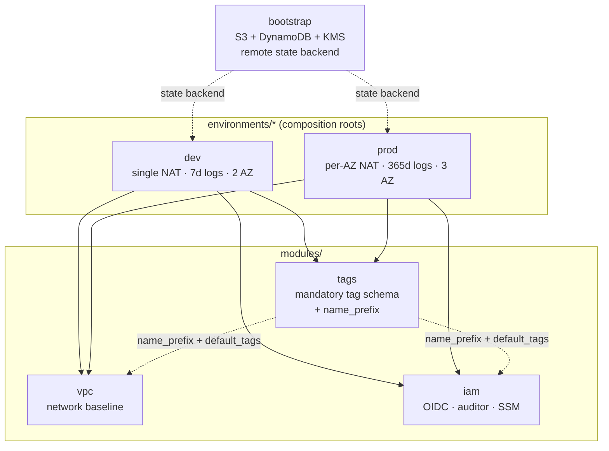
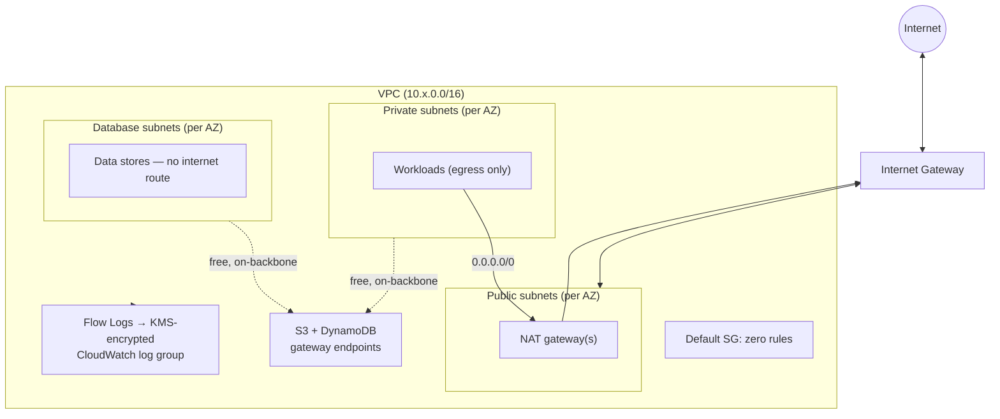

# Architecture

## Composition

Three reusable modules, composed by thin per-environment roots. The roots
declare no resources of their own — they wire modules together and set the
knobs that differ between dev and prod.

## Network (per environment)

Key points the diagram encodes:

- **Public → NAT → private → database** is a one-way funnel. The database tier
  has no default route at all: nothing there reaches or is reached from the
  internet.
- **Gateway endpoints** carry S3/DynamoDB traffic (including remote state) on
  the AWS backbone, so it never touches — or is billed by — the NAT gateway.
- **Flow logs** land in a KMS-encrypted log group via a dedicated, scoped IAM
  role.
- The **default security group** is managed with zero rules, so it denies all
  traffic instead of shipping AWS's permissive default.

## Decisions in brief

Each of these has a short ADR under [`decisions/`](decisions/):

| Decision | Rationale | ADR |
|----------|-----------|-----|
| Remote state in S3 + DynamoDB, bootstrapped once | State can't store its own backend's creation | [0001](decisions/0001-remote-state-backend.md) |
| GitHub OIDC instead of static AWS keys in CI | No long-lived credentials to leak or rotate | [0002](decisions/0002-oidc-over-static-keys.md) |
| Single vs per-AZ NAT as an environment toggle | Cost in dev, resilience in prod — an explicit tradeoff | [0003](decisions/0003-single-vs-per-az-nat.md) |
| SSM Session Manager instead of SSH/bastion | Removes port 22, key pairs, and a host to patch | [0004](decisions/0004-ssm-over-ssh.md) |
