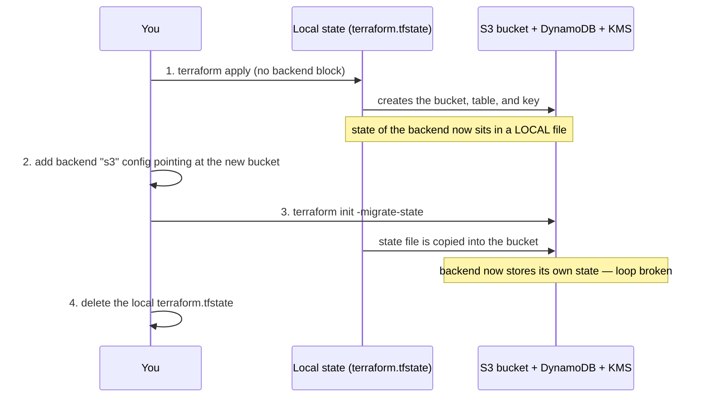

# The bootstrap problem (chicken-and-egg state)

This is the single most common "explain this to me" question in a Terraform
interview, so it's worth stating plainly.

## The problem

Terraform keeps a **state file** — its record of what it has created. For a team,
that state lives in a remote backend: an S3 bucket, with a DynamoDB table for
locking so two people can't apply at once.

But that bucket and table are themselves infrastructure. If you manage them with
Terraform — and you should — you hit a loop:

> To store state in the S3 backend, the backend must exist.
> To create the backend with Terraform, Terraform needs somewhere to store the
> state of *creating the backend*.

The backend can't hold the state of its own creation. Chicken, meet egg.

## The resolution

Break the loop by creating the backend with **local state first**, then moving
the state into the backend once it exists.



## Concretely

```bash
# 1. Create the backend with local state.
cd bootstrap
terraform init          # local backend
terraform apply

# 2. Read the values you need for the backend config.
terraform output        # state_bucket_name, lock_table_name, kms_key_arn, region

# 3. Migrate THIS module's own state into the bucket it just created.
#    (Optional but tidy — bootstrap can also keep local state committed nowhere.)
#    Add a backend "s3" block, then:
terraform init -migrate-state

# 4. Point each environment at the backend and initialise it.
cd ../environments/dev
cp backend.hcl.example backend.hcl   # fill from the outputs above
terraform init -backend-config=backend.hcl
```

## Why the `bootstrap/versions.tf` has no backend block

That's deliberate, and commented in the file. On the first run there is nothing
to point a backend at. Local state is correct for exactly one apply; after that,
the backend exists and everything (including bootstrap itself, if you choose)
can migrate into it.

## What the backend provides

- **Versioning + lifecycle** on the state bucket → point-in-time recovery of a
  corrupted or fat-fingered state.
- **SSE-KMS** with a customer-managed, rotating key → state at rest is encrypted
  under a key you control. State can contain secrets, so this matters.
- **TLS-only bucket policy** → state in transit can't be read off a plaintext
  connection.
- **DynamoDB lock** → no two applies clobber each other.

See [`bootstrap/README.md`](../bootstrap/README.md) for the full resource list.
